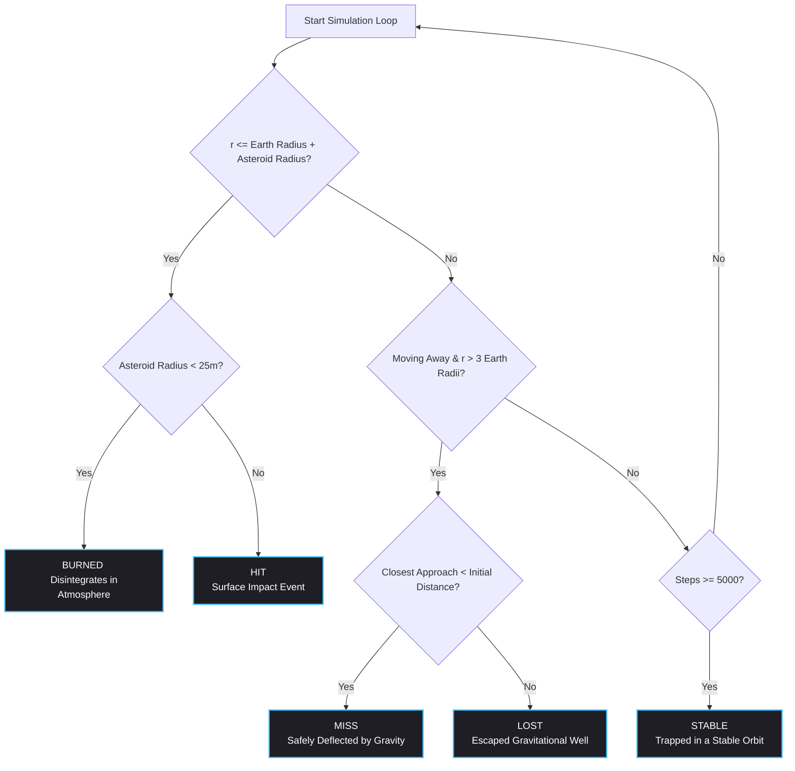

<h1 align="center">AeroTrack-Prime</h1>
<p align="center">Desktop Command Dashboard About Asteroids</p>
<div align="center">
  <a href="https://github.com/tirthas970-cmyk">tirthas970-cmyk</a>
</div>
<br><br>

<p align="center">
  
</p>


#### What does it do?
* **NASA Feed Table**: A clean, updating table that shows real names, speeds, and sizes of every asteroid passing Earth today, pulled live from Nasa's actual satellites
* **Threat Assessment Panel**: Shows asteroids with the highest potential energy
* **AI Profile Analysis**: Classifies selected asteroid into a specific group based on historical data using Machine Learning
* **Automated Report Generator**: A text file that details all information of the selected asteroid
* **Trajectory Modifier**: Slide bars where you can manually change an asteroid's variables, and see if your mock asteroid hits or misses Earth!

## How to Run?
* Click on this link: https://aerotrack-prime-4hx2awdqlc4qm8pawawcya.streamlit.app/
   * This is the public version!

## Installation & Local Setup

If you want to run the dashboard locally on your machine instead of using the Streamlit Cloud link, follow these steps:

### Prerequisites
- **Python**: 3.13.2
- **NASA API Key**: Get a free key instantly at [api.nasa.gov](https://nasa.gov)

### Step-by-Step Setup

1. **Clone the repository:**
   ```bash
   git clone https://github.com
   cd AeroTrack-Prime
   ```

2. **Create and activate a virtual environment (Recommended):**
   ```bash
   # Create environment
   python -m venv venv
   
   # Activate on Windows:
   .\venv\Scripts\activate
   
   # Activate on macOS/Linux:
   source venv/bin/activate
   ```

3. **Install dependencies:**
   ```bash
   pip install -r requirements.txt
   ```

4. **Configure your NASA API Secrets:**
   * Create a folder named `.streamlit` in your project's root directory.
   * Inside that folder, create a file named `secrets.toml`.
   * Add your API key to the file exactly like this:
     ```toml
     nasa_key = "YOUR_ACTUAL_API_KEY_HERE"
     ```
   *(Note: The `.streamlit/secrets.toml` file is automatically ignored by git to keep your key secure!)*

5. **Launch the application:**
   ```bash
   streamlit run app.py
   ```


## Key Files Explanations:
* The files that my program depends on are:
  * **app.py**: The file that creates the streamlit GUI, and uses the other files
  * **AsteroidData.py**: This file fetches NEO data using NASA API, finds the cluster group of a new asteroid and characterizes them, gets the highest potential energy asteroid, and creates the .txt file
  * **TrajectoryEngine.py**: This file calculates whether or not a mock asteroid will hit earth, calculates the highest potential energy (which is used in AsteroidData.py, and animates the mock asteroid into a gif
  * **Markdown.py**: The overall aesthetics of my program
    * Not in app.py because it made the file too long
  * **Plot.py**: Plots the new asteroid datapoint into the existing cluster groups
* **NeoClassifierV2.ipynb**: This is the notebook that contains my unsupervised KMeans Model
* **.joblib** files: These files were saved as .joblib files from the notebook; used in AsteroidData.py to find the cluster of a new asteroid
* **requirements.txt**: The requirements to create this app in Streamlit

##  Physics Engine & Simulation Logic

For the **Trajectory Modifier**, I did a  **2-Body Gravitational Simulation**, using **Euler-Cromer Integration** loop

### 1. Mathematical Model

#### Mass Estimation
The engine assumes a spherical asteroid to calculate its volume and derived mass:
$$V = \frac{4}{3}\pi r^3 \quad \implies \quad m = V \cdot \rho$$

#### Universal Gravitation
At each time step $\Delta t$, the engine calculates the acceleration vector $\vec{a}$ that is exerted by Earth's gravitational well:
$$a = \frac{G \cdot M_\oplus}{r^2} \quad \implies \quad a_x = -a \cdot \left(\frac{x}{r}\right), \quad a_y = -a \cdot \left(\frac{y}{r}\right)$$


### 2. Advanced Optimization Features

####  Time-Stepping ($\Delta t$)
* **Deep Space:** $r > 5 R_\oplus \implies \Delta t = 30.0\text{ seconds}$
* **Approach Buffer:** $1.5 R_\oplus < r \le 5 R_\oplus \implies \Delta t = 5.0\text{ seconds}$
* **Terminal Proximity:** $r \le 1.5 R_\oplus \implies \Delta t = 0.1\text{ seconds}$

####  Vector Dot Product State Termination
I check if the asteroid is escaping or crashing using a **Vector Dot Product** ($\vec{r} \cdot \vec{v}$):
$$\text{Directional State} = (x \cdot v_x) + (y \cdot v_y)$$
* $\vec{r} \cdot \vec{v} < 0 \implies$ The asteroid is gaining speed and falling **towards** Earth.
* $\vec{r} \cdot \vec{v} > 0 \implies$ The asteroid is moving **away** from Earth.

---

### 3. Simulation Outcomes (`AsteroidStatus`)

The loop runs up to a maximum of `5000` steps and terminates cleanly into one of five states:



## Calculation of Highest Potential Energy in MT
The **Threat Assessment Panel** uses physics equations to find out which asteroids had the highest potential energy 
* **$(d^3 \times v^2)$**: Used to figure out which of the asteroids in the list has the highest kinetic energy.

To find the energy in MT, the asteroid with the highest kinetic energy is processed through these two equations:

$$
m = \frac{4}{3} \pi \left(\frac{d}{2}\right)^3 = \frac{\pi}{6} d^3
$$

$$
\text{Energy in Megatons} = \frac{0.5 \cdot m \cdot v^2}{4.184 \times 10^{15}}
$$


## ML Deepdive
* For the **AI Profile Analysis**, I used **unsupervised learning**, which means that the model groups data points based on their natural and existing similarity to one another without pre-made labels
* The dataset used: https://www.kaggle.com/datasets/ivansher/nasa-nearest-earth-objects-1910-2024
  * 330,000+ columns with 30,000+ unique historica NEOs
* Used KMeans model for this unsupervised learning -
  * This is because it is simple, fast, and scales efficiently to massive datasets
* Parameters for the model
  1) Absolute Magnitude (H)
  2) Max Diamter (meters)
     * Used log^10 
  3) Velocity (mph)
  4) Miss Distance (miles)
     * Used log^10
* Dataset was scaled using Standard Scaler
* Implemented PCA to reduce the dimensions (feautres) of dataset

Image of Cluster:

  
## Technologies Used:
* Python: 3.13.2
* Vs Code
* Google Colab
  
## Why I built this?
* Interested in astronomy and computer science
  * This project combines those to interests into a real usable application
* Enables me to incorporate other interests like ML and physics into the program
* Helps me learn both backend and frontend skills
* Allows one to find all data about asteroids, specifically Near-Earth-Asteroids (NEOs)

## Developmental Timeline:
* Around 2 Months (Late June 2026 - Early September)
* On and Off between other projects
  * Most of the work was done early to mid July, and late to early September

## Key Milestones:
* Month 1: Getting the GUI setup, NASA feed table, threat panel, and trajectory modifier
* Month 2: Doing Unsupervised machine learning for AI Profile Analysis, polishing the GUI, creating a GIF of mock asteroids, publishing to Streamlit Cloud

## Future Roadmap:
> Note: This project is considered complete in regards to functionality. However, soon, I will make my code more readable professional. Feel free to fork this repository and further develop it using these ideas:
* Create a feature that shows historical asteroids
* Update **Trajectory Modifier** to incorporate Earth's magnetic field on whether or not an asteroid will burn up when entering the atmosphere
* Create a interactive 3D orbit viewer


## Final Comments:
> Note that **Google Gemini** was used for GUI debugging and helping out with the physics. Other than that, I wrote almost all the code for this program. **ChatGPT** was also used for initial concept images of this dashboard.

##  License
This project is licensed under the MIT License - see the [LICENSE](LICENSE) file for details.


## Pictures:


